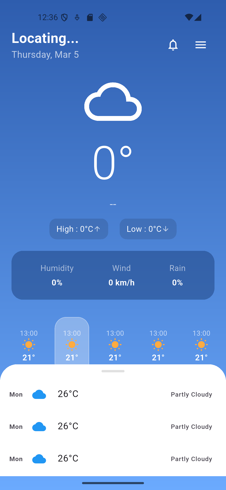
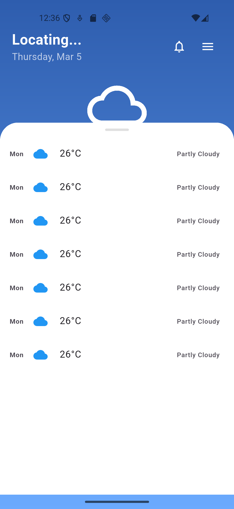

# OpenWeather App

A beautiful, functional Flutter weather application inspired by OpenWeather. This app fetches real-time weather data and displays it in a clean, user-friendly interface using modern Flutter architecture and state management.

## Features

*   **Current Weather Conditions:** Displays temperature, weather icon, description, high/low temperatures, humidity, wind speed, and rain chance.
*   **Hourly Forecast:** Horizontal scrollable list showing weather changes throughout the day.
*   **Daily Forecast:** A convenient draggable bottom sheet (DraggableScrollableSheet) displaying the upcoming week's weather forecast.
*   **Clean UI/UX:** Utilizes engaging gradients, smooth transitions, and easy-to-read typography.
*   **Location-Aware:** Uses `geolocator` and `geocoding` for fetching localized weather data.
*   **Persistent Storage:** Implements `get_storage` for caching and local data management.

## Screenshots

<p align="center">
  
  
</p>

## Tech Stack

*   **Framework:** [Flutter](https://flutter.dev/) (Dart)
*   **State Management & Routing:** [GetX](https://pub.dev/packages/get)
*   **Networking:** [http](https://pub.dev/packages/http)
*   **Local Storage:** [get_storage](https://pub.dev/packages/get_storage)
*   **Location Services:** [geolocator](https://pub.dev/packages/geolocator), [geocoding](https://pub.dev/packages/geocoding)

## Architecture

The project follows a modular architecture (MVVM/Clean Architecture variant) for better maintainability and scalability:

*   `data/`: Handles networking (`http`) and API communication.
*   `models/`: Data classes (e.g., `weather_model.dart`).
*   `repository/`: Abstracts data sources from view models.
*   `view_models/`: Contains GetX controllers (e.g., `home_view_controller.dart`) handling business logic and state.
*   `views/`: UI components (`home_view.dart`, `splash_view.dart`).
*   `res/`: Resources like colors, routes, and constants.
*   `utils/`: Helper functions.

## Getting Started

### Prerequisites

*   Flutter SDK (^3.10.4 or higher)
*   Dart SDK

### Installation

1.  Clone the repository:
    ```bash
    git clone https://github.com/your-username/weather_mine.git
    cd weather_mine
    ```

2.  Install dependencies:
    ```bash
    flutter pub get
    ```

3.  Run the application:
    ```bash
    flutter run
    ```

## Development

*   To run tests:
    ```bash
    flutter test
    ```
*   To format code:
    ```bash
    dart format .
    ```

## License

This project is licensed under the MIT License - see the LICENSE file for details.
